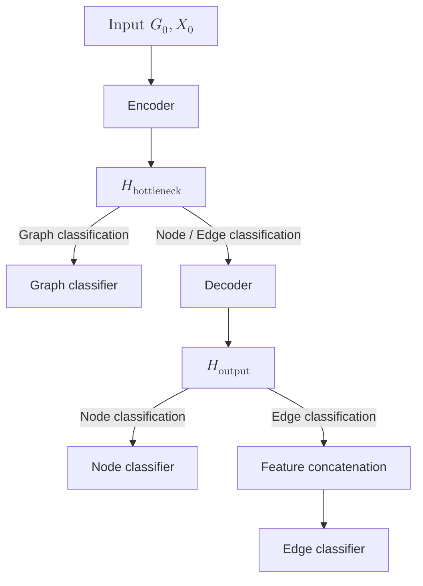

# Empool

This GitHub repository contains the source code of the *Empool* architecture
defined in our [paper](https://arxiv.org) and used for the experiments and
benchmarking presented therein.

### General Forward Pass Pipeline

